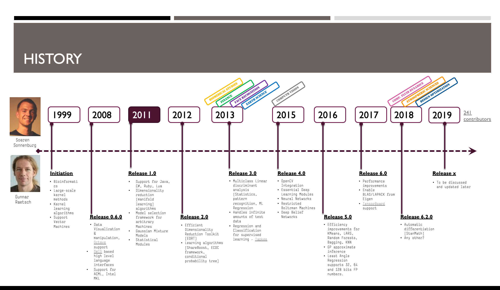

# ShogunML

|  |  |  |  |
| :--- | :--- | :--- | :--- |
|  |  |  |  |

## Introduction

Shogun is a library for efficient and unified Machine Learning \(ML\), with its main distinguishing feature being that its C++ core can be used from a wide range of languages \(Python, R, Java, Octave, etc.\) via a unified API. 

It is currently deployed to address a variety of use cases including but not limited to the following:

* Face Recognition
* Image Processing
* Computational Fluid Dynamics \(CFD\)
* Engineering Design Optimization

ShogunML is utilized by users world-wide and its applications span across several industries such as bioinformatics, biomedical sciences, banking and finance, earth sciences, atmospheric sciences, weather modelling and simulations and more.  

The library contains many state-of-the-art implementations of modern ML algorithms, as well as many algorithms that are not part of other libraries. The project is one of the oldest ML libraries that was initiated in 1999. It is one of the largest ML codebases with a vibrant community. Refer to latest repository usage,  contribution and scientific citation statistics [here](https://www.openhub.net/p/shogun).

